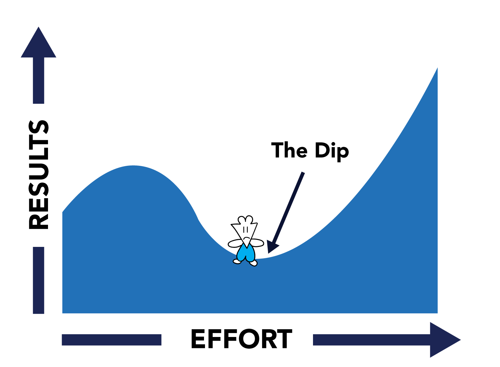

- #Week-2022-27
- DONE 学习 [[如何吃止痛药]]
  :LOGBOOK:
  CLOCK: [2022-07-06 Wed 11:04:06]--[2022-07-06 Wed 11:21:03] =>  00:16:57
  CLOCK: [2022-07-06 Wed 11:21:04]--[2022-07-06 Wed 11:21:04] =>  00:00:00
  CLOCK: [2022-07-10 Sun 23:22:37]--[2022-07-11 Mon 08:41:25] =>  09:18:48
  CLOCK: [2022-07-11 Mon 09:49:26]--[2022-07-11 Mon 11:19:09] =>  01:29:43
  :END:
- DONE [Thought Stop Signs](https://moretothat.com/thought-stop-signs/)
  :LOGBOOK:
  CLOCK: [2022-07-06 Wed 11:04:05]--[2022-07-06 Wed 11:13:23] =>  00:09:18
  CLOCK: [2022-07-06 Wed 11:21:12]--[2022-07-06 Wed 11:35:55] =>  00:14:43
  :END:
	- A word or phrase that is intended to put an end to an otherwise sound line of reasoning.
	- **A general feature of a Thought Stop Sign is that it is accepted as a reasonable explanation to the in-group, and rejected as an absurd excuse to the out-group.**
	- ~~I'm not sure why, but all I know is that it's true~~
	- What are the reasons of  the `TRUTH` - the thought stop sign? #card #Thought
	  card-last-score:: 3
	  card-repeats:: 1
	  card-next-schedule:: 2022-07-10T03:22:23.718Z
	  card-last-interval:: 4
	  card-ease-factor:: 2.36
	  card-last-reviewed:: 2022-07-06T03:22:23.719Z
		- You're personally benefited from having the belief
		- It happens to coincide with your identity
		- You're fearful to admit otherwise
	- Solutions
		- Actively introduce uncertainty again
		- Google search the "arguments against (insert view)"
	- > There are many more ways to worship something than lighting candles around an altar.
- DONE [The Survival Instinct of Money](https://moretothat.com/the-survival-instinct-of-money/)
  :LOGBOOK:
  CLOCK: [2022-07-06 Wed 11:43:23]--[2022-07-06 Wed 12:03:07] =>  00:19:44
  :END:
	- Our attachment to preservation
	- Our tendency to use growth as a proxy for survival
	- > The more money you have, the more you have to preserve. And the more you have to preserve, the more fear that surrounds its potential loss.
- DONE [The Quest to the Unlived Life](https://moretothat.com/the-quest-to-the-unlived-life/)
  :LOGBOOK:
  CLOCK: [2022-07-06 Wed 19:40:00]--[2022-07-06 Wed 19:40:01] =>  00:00:01
  CLOCK: [2022-07-06 Wed 22:05:09]--[2022-07-06 Wed 23:19:00] =>  01:13:51
  :END:
	- The Levels
		- Laziness - **Perception**
			- The stronger the regret associated with that laziness, the more the endeavor actually means to you.
			- A broadly defined goal is Laziness’ best friend, as the hugeness of it will constantly freak you out.
			- Instead of viewing a goal as something to be reached in its sheer totality, treat each day as a compartment that has its own small aspiration attached to it.
		- Self Doubt - **Reflection**
			- As you continue investing time and effort into your endeavor, you notice that things aren’t as easy as you thought they’d be.
			- Underneath the rough texture of Self-Doubt’s immediate appearance, you will notice that its skin is made up of everything you’ve once loved, everything you once cared deeply about, and everything you’ve also failed at as well.
			- Evaluating its presence throughout your journey is critical to understand your relationship with the endeavor, and it’s important to remind yourself that it ultimately is a reflection of love.
		- Uncertainty - **Inner Child**
			- The over-identification of ourselves with this one pursuit exaggerates its magnitude, blurring out everything else and fogging up what life actually looks like.
			- We need to analyze the ways we react to Uncertainty, and try to understand what’s going on underneath-the-hood of these emotions.
			- Stay curious, ask what and how.
		- 
- DONE [The Time Trap of Productivity](https://moretothat.com/the-time-trap-of-productivity/)
  :LOGBOOK:
  CLOCK: [2022-07-06 Wed 13:45:12]--[2022-07-06 Wed 13:49:53] =>  00:04:41
  :END:
	- Productivity is a set of systems or rituals that protect us from future regrets.