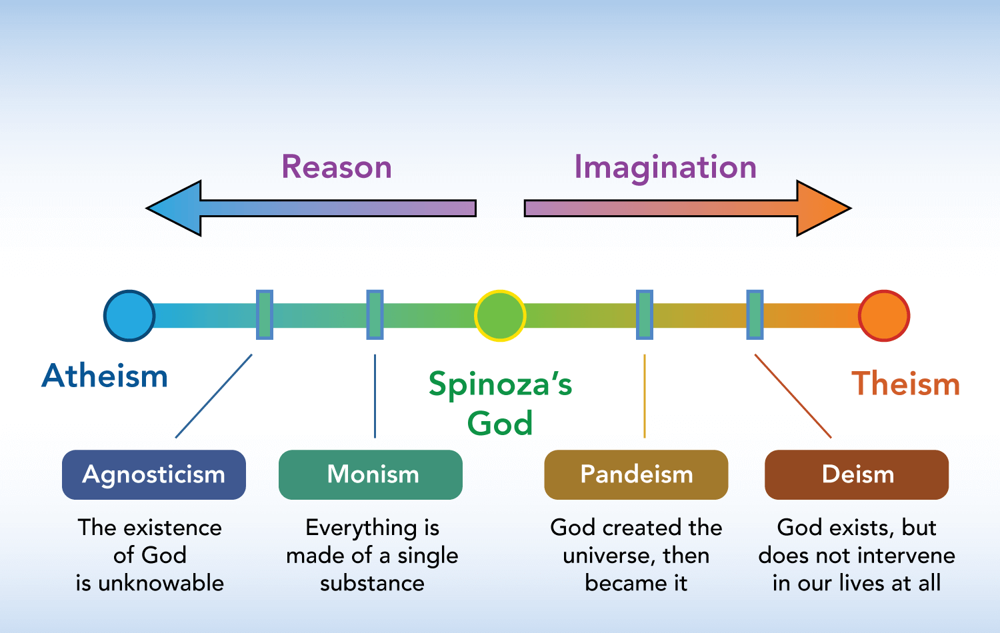
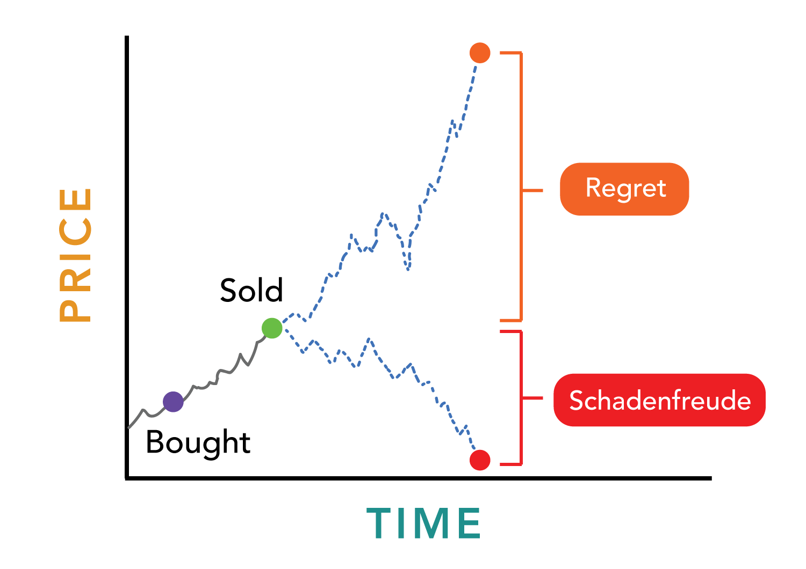

- #Week-2022-27
- DONE [Do you really believe what you believe?](https://moretothat.com/do-you-really-believe-what-you-believe/)
  :LOGBOOK:
  CLOCK: [2022-07-08 Fri 09:08:17]--[2022-07-08 Fri 09:12:54] =>  00:04:37
  :END:
	- 主要探讨了为什么有些人说一套，做一套。
	- 知行合一 **True Belief**  ~~Or is it?~~
	- > Where it is difficult to believe a thing, it is often much easier to believe that you ought to believe it.
	- Words and actions are mere signals of a belief, but only thoughts reveal true intentions.
	- Introspection is about checking yourself in that moment, and revising that misguided route to direct it toward the truth. It’s about being committed to drawing your map to the best of your ability, and not in a way that is convenient and reliant upon the expectations of others.
	- Question your words, Observe your actions, Have your thoughts
- DONE [God Is a Spectrum of Being](https://moretothat.com/god/)
  :LOGBOOK:
  CLOCK: [2022-07-08 Fri 09:19:07]--[2022-07-08 Fri 09:43:23] =>  00:24:16
  :END:
	- **Even if we use the laws of physics to explain the universe, we cannot use them to explain why the universe is organizable into laws in the first place.**
	- Belief-in-God is not binary, rather a spectrum
	- **If God is nature, then by definition, God couldn’t be anything supernatural.**
	- The **totality of existence**: the sum total of every individual object and relationship that exists (and has ever existed)
	- 
	- 没有必要纠结于无神论和有神论，All by the Nature
	- > _I believe in Spinoza’s God, who reveals himself in the lawful harmony of the world, not in a God who concerns himself with the fate and the doings of mankind._
- DONE [Speculation: A Game You Can’t Win](https://moretothat.com/speculation/)
  :LOGBOOK:
  CLOCK: [2022-07-08 Fri 16:12:34]--[2022-07-08 Fri 16:57:22] =>  00:44:48
  :END:
	- About Climbing - Despite the arduous trek, the motivating thing about this hike is that the end is always insight.
	- **Realized gains feel like penalties when they’re interpreted as missed opportunities.**
	- 
	- **Schadenfreude** -  A German word for taking pleasure at another's misfortunes.