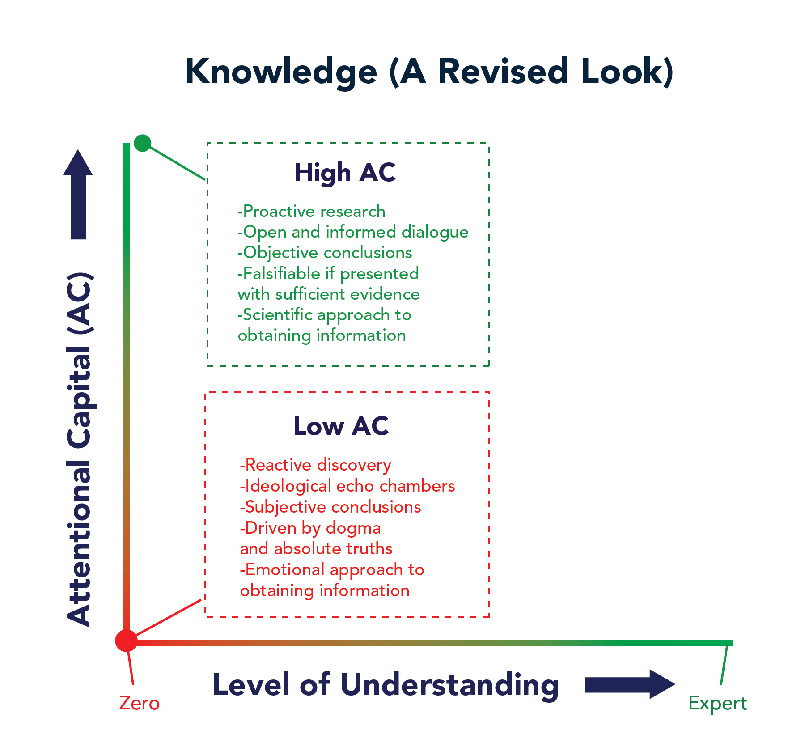

- #Week-2022-28
- Dive into [[Linux]] scheduler
  :LOGBOOK:
  CLOCK: [2022-07-11 Mon 23:20:12]--[2022-07-11 Mon 23:27:55] =>  00:07:43
  :END:
- DONE [Knowledge is not a Thing](https://moretothat.com/knowledge-is-not-a-thing/)
  :LOGBOOK:
  CLOCK: [2022-07-11 Mon 14:16:00]--[2022-07-11 Mon 14:31:06] =>  00:15:06
  :END:
	- Knowledge
		- awareness of familiarity gained by experience of a fact or situation
		- facts, information, and skills acquired by a person through experience or education; the theoretical or practical understanding of a subject
	- $Education = Curiosity + Diligence$
	- 