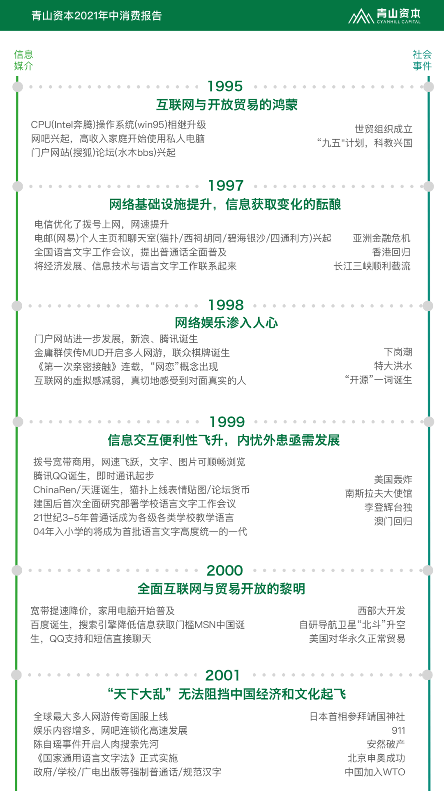
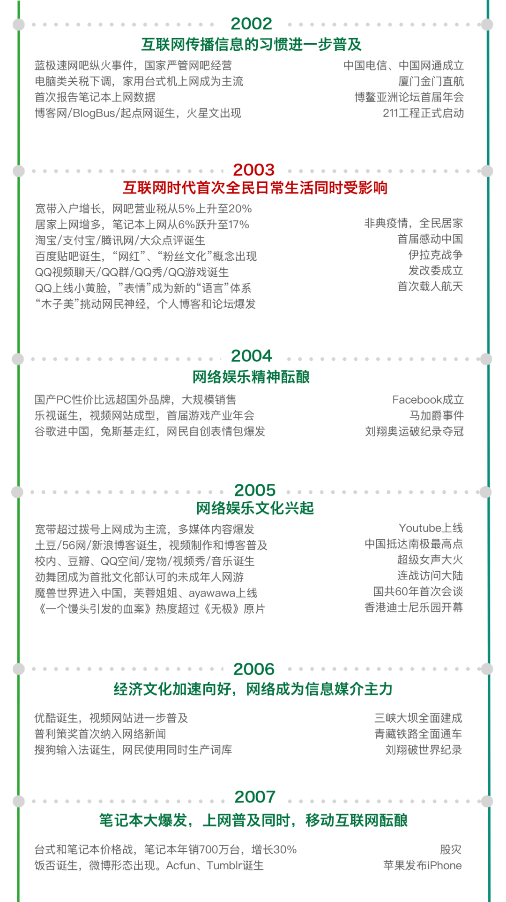
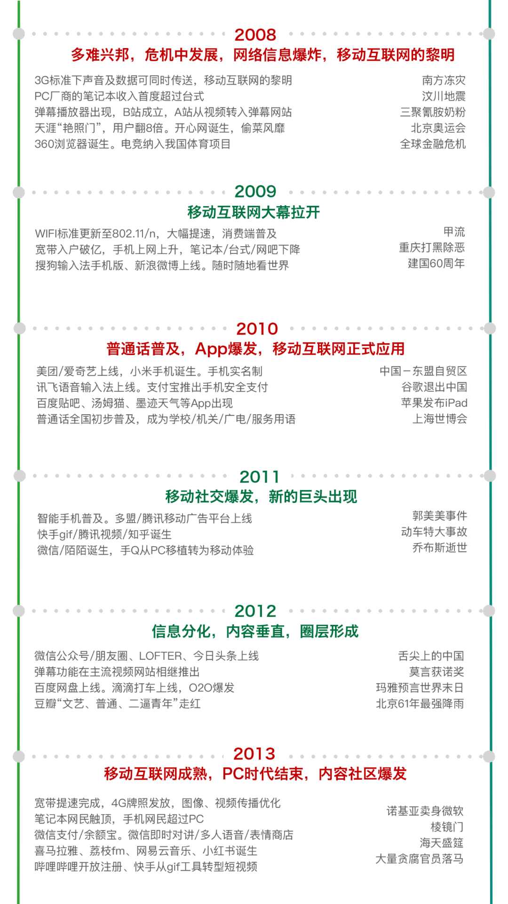
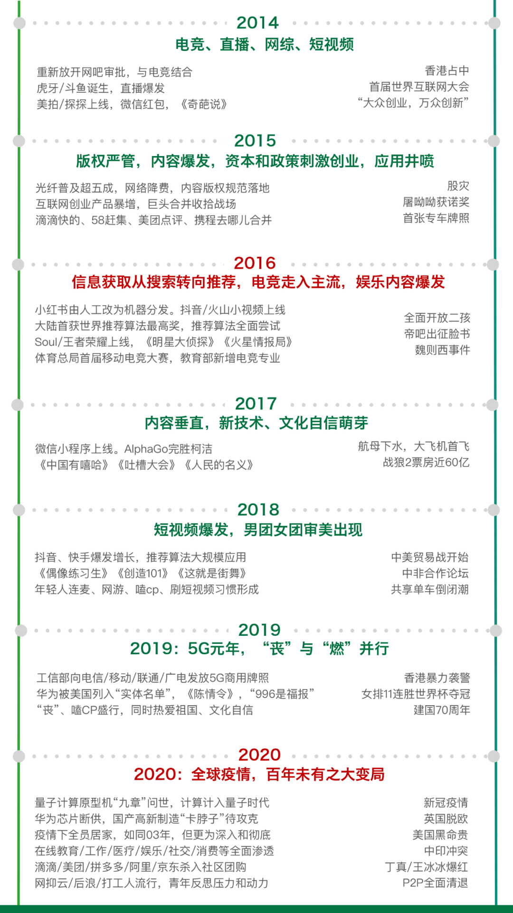
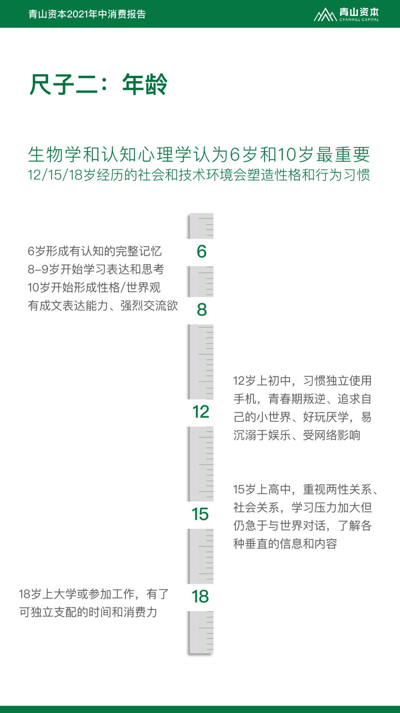
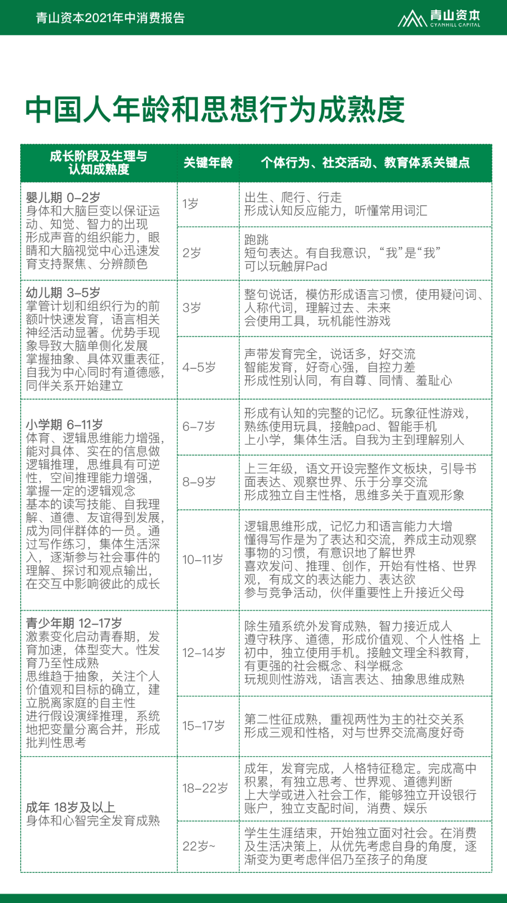

- #Week-2022-29
- DONE 学习[[如何跑步]]
- 阅读 [我们正进入高成本时代](https://mp.weixin.qq.com/s/cifcxxQsHNejX6X3Jnq1UQ)
	- PPI「工业生产者出厂价格指数」CPI「消费价格指数」
	- PPI -> CPI 价格传递不畅，意味着消费者已处于购买力不足的处境
	- 金融危机、新冠疫情和俄乌战争，这三股力量引发了逆向全球化，意味着资源配置效率下降、供应成本上升
	- 工资-物价通胀螺旋，即工资增长，消费扩张，物价上涨；物价上涨又拉动工资上涨
	- 通胀和负载是高成本时代的两座大山
- 中国现代化进程
	- 对城市的崇拜
	- 来势汹汹的消费主义
	- 对互联网和智能手机的依赖
- 阅读 [孤独之下，独居时代丨青山资本2021年度消费报告](https://mp.weixin.qq.com/s/GsCWP-fRjagqoNXm11NLPQ)
	- 以家庭为单位的群居生活是人类几万年来的主要生存结构。最初选择群居是为了保障生命安全，并通过集体狩猎获得更好的食物结构
	- 在工业革命、市场经济和城市化的作用下，更安全的环境、更细化的分工出现，人类社会的整体和个体的生存质量、心理状态也 发生变化。到现在，人类显著出现了宏观群居、围观独居的状态
	- 影响居住选择的三个因素
		- 社会观念
		- 伴侣匹配
		- 生存质量
	- 人更加多面，整体契合更难 - 间接导致了对「伴侣」的要求更高 - 直接导致了单身人口激增 - 侧面影响到国内的净人口增长数
	- 长期稳定相处更难实现
		- 想付出，又不敢。城市化之下，人追求效率，整体快节奏，每个人的时间都紧张，愿意给彼此宽容和试错的时间长度、次数都会更加有限。又因为彼此都更佳注重自我，达到和谐状态需要更长时间、更多次数的调整和磨合。
		- 匹配到长期的对象后，能够进入稳定婚姻关系，也有很多现实的高成本在限制，包括经济压力和家庭融合。
	- **从前，需要家庭提供的遮风避雨和丰富多彩；现在，社会都可以给你**
	- 究其原因，还是价值观的变迁 - 随着一代代人的替换，过去许多被认为是禁忌的事情，现在被视作正常了；自由恋爱，离婚，独居等等
- 阅读 [或许是今年最高分的华语电影](https://mp.weixin.qq.com/s/G9Xkv5_YNXR5MeKYYU7zQA) - 「隐入尘烟」
	- **越是失去，越是向往** - 乡土的淳朴气息
	- 但到头来，其实大多数人能做到的也不过是看一场电影，做一场梦，因为大家心知肚明，我们终究回不到过去。
- DONE 阅读 [Z世代定义与特征](https://mp.weixin.qq.com/s/2NCxms2OsCBYRpmAHUQ4ug)
	- 1998-2014
	- 世代并非一个固定尺寸的盒子，可以使用出生年份按5年/10年把人整齐收纳
		- 一个世代被单独划分，是地域上关联的一群人，在成长中同时经历了一些重大社会、科技和文化事件，共同的集体记忆使得其三观趋同
		- 同时日常生活习惯有同等的技术、产品、环境的支持，从而增强了对这一群人特征的可预测性，最终塑造了相似的消费观
	- 信息媒介、社会事件、成长周期
	- 历史事件、年龄段
	- 
	- 
	- {:height 1336, :width 747}
	- 
	- 
	- 