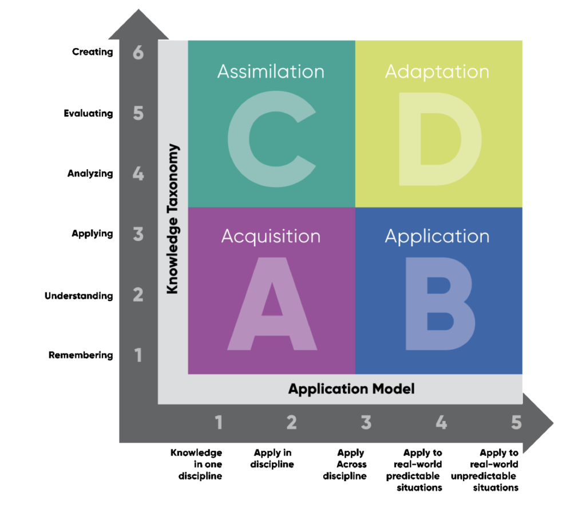

- #Week-2022-30
- The writer must be four people:
	- the nut, the obsede
	- the moron
	- the stylist
	- the critic
	- 1 supplies the material
	  2 lets is come out
	  3 is the taste
	  4 is intelligence
- 学习 [[中暑措施]]
- 如何 [[当个奶爸]]
- [The problem of long-term work](https://lucasfcosta.com/2022/07/15/long-term-plans-dont-work.html)
	- Three fundamentally broken assumptions
		- Nothing will go wrong
		- Product developers know precisely what they must build
		- Product developers know exactly how long each task is going to take
	- The alternative to long-term plans
		- Plan more carefully
		- Add a larger margin of error
- Read [The Einstein Principle: Accomplish More By Doing Less](https://www.calnewport.com/blog/2007/10/10/the-einstein-principle-accomplish-more-by-doing-less/)
	- The Einstein Principle
		- We are most productive when we focus on a very small number of projects on which we can devote a large amount of attention.
	- The Productivity Purge
		- When it feels like your schedule is becoming too overwhelmed, take out a sheet of paper and label it with three columns:_**professional**_,_**extracurricular**_, and_**personal**_. Under “professional” list all the major projects you are_currently working on_in your professional life (if you’re a student, then this means classes and research, if you have a job, then this means your job, etc). Under “extracurricular” do the same for your side projects (your band, your blog, your plan to write a book). And under “personal” do the same for personal self-improvement projects (from fitness to reading more books).
		- Under each list try to select one or two projects which, at this point in your life, are the most important and seem like they would yield the greatest returns. Put a star by these projects.
		- Next, identify the projects that you could stop working on right away with no serious consequences. Cross these out.
		- Finally, for the projects that are left unmarked, come up with a 1-3 week plan for finalizing and dispatching them. Many of these will be projects for which you owe someone something before you can stop working on them. Come up with a crunch plan for the near future for shutting these down as quickly as possible.
		- Once you completed your crunch plan you’ll be left with only a small number of important projects. In essence, you have purged your schedule of all but a few contenders to be your next Theory of Relativity. Here’s the important part:**Try to go at least one month without starting any new projects.**Resist, at all costs, committing to anything during this month. Instead, just focus, with an Einsteinian intensity, on your select list.
- [How to own your growth as a software engineer](https://build.betterup.com/how-to-own-your-growth-as-a-software-engineer/)
	- 
	-