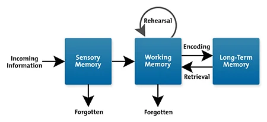

- #Theory
- ## Contents
	- How do we process information? #card
		- The information processing model
		- 
	- What is CLT? #card
		- `Cognitive load` relates to the amount of information that working memory can hold at one time.
		- Since working memory has a limited capacity, instructional methods should avoid overloading it with additional activities that don't directly contribute to learning.
- ## References
	- IPM - Adapted from Atkinson, R.C. and Shiffrin, R.M. (1968). 'Human memory: A Proposed System and its Control Processes'. In Spence, K.W. and Spence, J.T._The psychology of learning and motivation_, (Volume 2). New York: Academic Press. pp. 89–195.