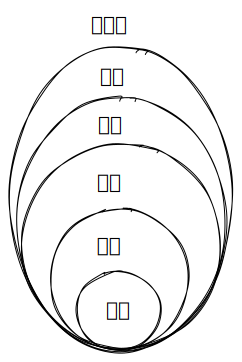

- #Week-Share
- ## Contents
	- ### 最核心的问题
		- 我们的家庭关系如何？
		- 为什么会变成这个样子？
		- 如何改进？
		- > 改变别人很难，只能先从改变自己出发
	- ### 家庭关系的发展
		- 人际关系等级如下
		- 
		- **人际关系需要持续经营**
		- 没有进行经营的关系图如下？
	- ### 费曼学习法
		- 如何进行主题学习
		- 如何真正吸收学习到的内容
		- 下一步要怎么走
- ## 总结
	- TODO 第一次分享总结