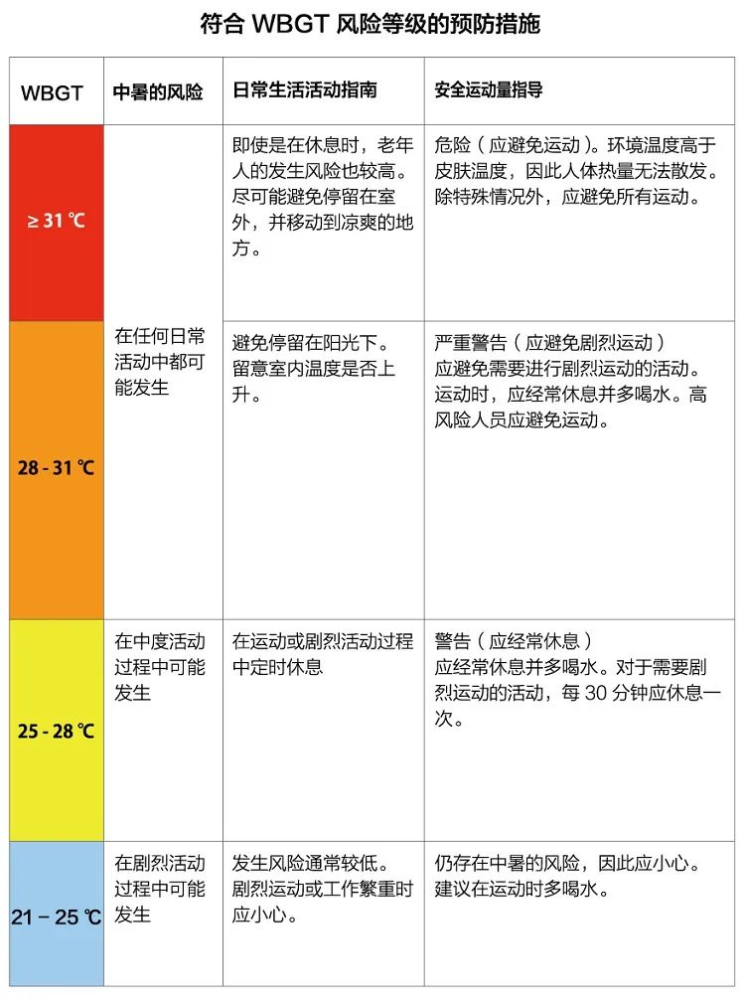
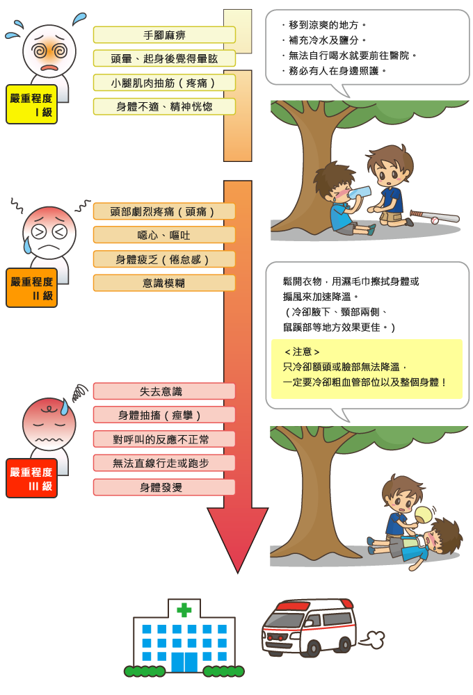
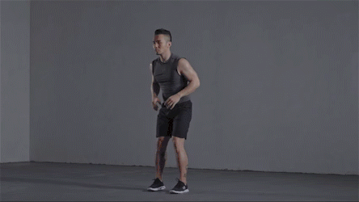
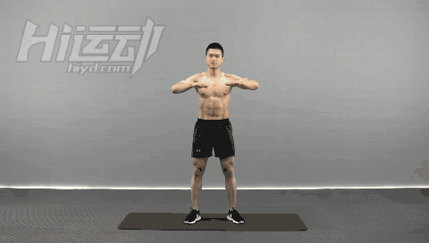
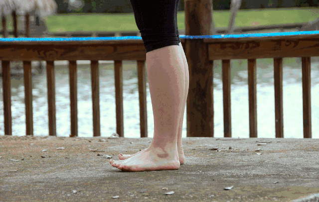

- #Excercise #Health
- ## Contents
	- ### 防暑
		- WBGT指数「Wet Bulb Globe Temperature」，即暑热指数。作为一种综合性的温度指标，不仅考虑到了温度，还考虑到了湿度和热辐射。
			- 公式 $$(WBGT) = 1(湿度)*7(温度)*2(辐射热)$$
			- 当WBGT大于28度时，热伤害类的病发作率会激增
			- 
	- ### 补充水分
		- 运动前 - 至少4h饮水5-7ml/kg
		- 运动中
			- 脱水不要超过2%体重
			- 补充的液体应包含20-30mEq的钠，2-5mEq的钾，5%-10%的碳水化合物
		- 运动后
			- 正常食物和饮料的补充有助于水合状态的恢复
			- 如果要快速恢复，体重没丢失1kg需饮水1.5L
	- ### 中暑对策
		- 
	- ### 热身
		- 作用
			- 预防跑步损伤
			- 提高跑步体验
		- 热身动作
			- 拉伸髂腰肌
				- 
			- 活动胸椎
				- 
			- 勾脚垫脚
				- {:height 335, :width 601}
- ## References
	- [敬畏热度、保持热情：如何在夏季坚持跑步](https://sspai.com/post/74342)