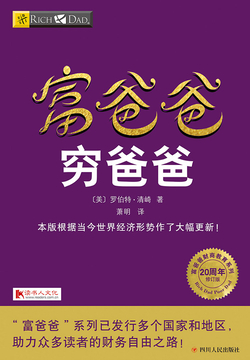

- #Book #Economy #Week-2022-28
- 
- ## Thoughts
	- 全文就两个字「投资」-> 「投机」
	- 当然，为了保证投资能够产生正向的收益，不仅需要来自「穷爸爸」的意见，也就是接受良好的教育，也需要来自「富爸爸」的意见，从生活中学习，培养自己的「财商」
	- 真正开始投资之前，需要整理个人的现状「资产负债表」
	- 超前消费只会为自己带来「借贷-工作螺旋」，使用资产的盈余购买商品才是真正的「奢侈品」
- ## Contents
	- 学会质疑约定俗成的生活方式
	- 学会从生活中学习，面临的阻碍越大，能学到的东西越多
	- 区分开什么是资产，什么是负债；资产会为你带来收入，负债则会增加你的支出；积累财富就是积累资产
	- 富裕不是现阶段你拥有多少钱，而是最后能留下多少钱；理财知识十分重要
		- 如果从现在开始不工作了，你的资产可以保证未来的生活，那么你就是「财富自由」了。
- ## Lessons
	- 富人不为钱工作 - 让钱为自己工作 - 学会投资
	- 为什么要教授财务知识 - 现代人陷入了打工=致富的怪圈
	- 关注自己的事业
	- 税收的历史和公司的力量 - 如何利用政府对公司的扶持政策免除掉税收
	- 学会不为钱工作
		- 对现金流的管理
		- 对系统的管理
		- 对人员的管理
	- 克服困难
	- 开始行动
		- 找一个超现实的理由 - 精神的力量
		- 每天做出选择 - 选择的力量
		- 慎重选择朋友 - 关系的力量
		- 掌握一种模式，然后再学习一种新的模式 - 快速学习的力量
		- 首先支付自己 - 自律的力量 「强迫自己做到更好」
			- 现金流管理
			- 人事管理
			- 个人时间管理
		- 雇佣最优秀的经纪人 - 建议的力量
		- 做一个「印第安给予者」 - 无私的力量
		- 用资产来购买奢侈品 - 专注的力量
		- 对英雄的崇拜 - 神话的力量
		- 先予后取 - 给予的力量
	- 其他需要完成的点
		- 停下手头的活
		- 寻找新的思想
		- 找一些做过你想做的事情的人
		- 参加辅导班、阅读和参加研讨会
		- 提出多份报价
		- 熟悉你的目标区域
		- 为什么消费者总是穷人
		- 关注适当的地方
		- 首先寻找想买进的人，再去找想卖出的人
		- 考虑大生意
		- 学习前人经验
		- 行动的人总会击败不行动的人
- ## References
	- [富爸爸穷爸爸 - 微信读书](https://weread.qq.com/web/reader/ada325807168230aada7458)