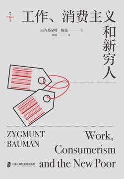

- #Book #Economy #Society #Week-2022-28
- 
- ## Thoughts
	- 处在一个消费者时代，每个人都无法避免「工作」
	- 工作伦理最开始就是资本家发明出来，用来以一种你情我愿的方式「奴役」工人，帮助他们积累资本罢了
- ## Contents
	- ### 创造工作伦理
		- 何为工作原理？
			- 让「工厂主」们能够心安理得「雇佣」工人们，帮助他们脱离贫穷的生活状况
			- 基于无条件服从的纪律规范，通过自上而下的有效监督，固化乏味的、规律有序的行为
		- 两个前提
			- 为了维持生活并获取快乐，每个人都必须做一些他人认同的有价值的事，并以之获取回报
			- 安于现状，不思进取是可耻的 --- 道义上来说，愚蠢又有害
		- 一项戒律
			- 即使你看不到任何（尚未得到的或不需要的）收益，你也应该继续工作。工作即正义，不工作是一种罪恶
		- 一个内隐假定
			- 绝大数人都有能力工作，通过工作可以获取相应回报，用以维持生活
		- **无论生活多么悲惨，只要它是由劳动报酬支撑的，就具有道德优越性。**
	- ### 从工作伦理到消费美学
		- 理想状态下，消费者应该不固守任何东西，没有永久的承诺，没有可以被完全满足的需求，也没有所谓的终极欲望。任何承诺、任何忠诚的誓言，都应该有一个附加的有效期。契约的有效期、既定的时效是最关键的，比契约本身更重要，它不应该超过满足欲望的消费所花费的时间（或欲望消退的时间）。
	- ### 福利国家的兴衰
	- ### 工作伦理和新穷人
	- ### 全球化之下的工作与过剩
		- 资本主义初期，其动力来自征服并殖民“处女地”——把生产者和生产资料分离，把商业活动和家庭经济分离，从而把非现代化的生活带入市场经济的轨道，并将其变成资本的牧场。一旦这项工作完成，可以改造的“处女地”所剩无几，现代资本主义社会的进一步生存就取决于把已经现代化的部分进一步现代化。
		- 当需要治疗的病症很大程度上是医源性的，即病症是治疗本身的副产品，当重组的对象大多数是过去重组的产物，是过去破坏性喧嚣的恶报时，幻觉就不再能够维系。除了装睡的人，大家都清楚，所有的创造都是创造性的破坏。所有的创造都会留下一些具有污染性且常常有毒性的残渣——“合理化”的废弃物。合理化就是分离合理化对象中有用的（无论如何定义与衡量“有用”）部分和“无用”（过剩）的部分，并对后者进行清理。
	- ### 新穷人的前景
		- 渴望把人类世界变成一个无机的世界，在那里一切都完美运行，按部就班，服从于一个超越个体的系统。然而，向往秩序就是向往死亡，因为生命本身就是不断破坏秩序的过程。或者换句话说：对秩序的渴望是一种堂皇的托辞，是强烈厌世的借口。
		- 每一个已知的社会都对穷人持一种特有的矛盾态度，一方面是恐惧和反感，另一方面是怜悯和同情。这两种成分都不可或缺。前者允许在需要秩序维护的时候对穷人进行严厉的处理；后者强调了那些达不到标准的人的悲惨命运，由此让正常生活的人在遵守社会规范时遭遇的所有艰辛都变得微不足道。
		- > 在挖掘穷人的价值方面，前现代的欧洲比现代做得更好。那时的穷人和其他所有人一样都是上帝的子民，是“神圣的存在之链”中不可缺少的一环。作为上帝造物的一部分，他们的存在本身就充满了意义和目的。穷人确实受苦，但他们的苦难是对原罪的忏悔，是得到救赎的保证。那些更幸运的人可以帮助、救济这些穷人，并在这个过程中获得自己的救赎。因此，穷人的存在是上帝的礼物：一个实践自我牺牲、施行善举、忏悔罪孽、获得救赎的机会。可以说，一个依靠来世寻求尘世生活的意义的社会，如果没有穷人的存在，就需要另外寻找一种救赎的手段。
		- 人们还是普遍认为工作伦理是一剂良药，甚至不可或缺，可以一石三鸟地解决贫困、劳动力不足和革命的威胁，能够成为撒在苦涩糕点表面的糖霜。
- ## Quotations
	- 传统的观念根深蒂固地认为人的需求是既定的，并不渴望追求更多。一旦这些既定需求得到满足，“因循守旧”的工人就彻底丧失了继续工作的动力，无意赚取更多金钱。世界上还有那么多有趣又体面的事情可以去做，那些都是金钱买不到的，夜以继日拼命赚钱只会和它们失之交臂。这种体面生活的门槛被设定得很低，一旦到达人们就失去了继续攀升的动力。无论如何，这就是那个时代的企业家、深刻意识到问题严重性的经济学家，以及渴望改善世界的布道者描绘的画面。
	- 工作不需要被热爱，也不需要被认为是道德的象征，人们可以公开反感工作，这不会招致纪律的崩坏，因为他们相信当下的忍耐（哪怕是最恶劣的境况）是为了并不遥远的自由而暂时付出的代价。
	- 新的工厂系统需要的只是人的一部分：身处复杂机器之中，如同没有灵魂的小齿轮一样工作的那部分。这场战斗是为了对抗人身上那些“无用的部分” --- 兴趣和雄心，它们不仅与生产力无关，还会干扰生产需要的那些“有用的部分”。
	- **工作伦理的本质是对自由的摒弃**。
	- 在全民就业的生产者社会，贫穷是一回事；在生活围绕消费者选择（而非围绕工作、专业技能或岗位）建议的消费者社会里，贫穷是另一回事。如果说“贫穷”曾经来自失业，那么今天它主要来自有缺陷的消费者的困境。
	- **工作伦理在现代生产者的思想和行动中灌输的与其说是“资本主义精神”，不如说是以经济水平评判人的价值和尊严的倾向。这也把人的动机和对自由的渴望牢牢地、不可逆地转向消费领域**。
	- 想要提高消费者的消费能力，就不能让他们休息。他们需要不断地接受新的诱惑，持续处于永不枯竭的兴奋之中，持续处于怀疑和不满之中。
- ## References
	- [工作、消费主义和新穷人 - 微信读书](https://weread.qq.com/web/reader/c9d327e0727abffcc9d74ab)