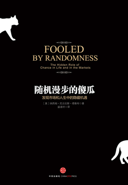

- #Book #Week-2022-29
- 
- ## Thoughts
	- 从随机事件中「总结」经验教训是一件很不理智的事情
		- 问题在于，这个随机事件所带来的「成果」很容易就冲走仅剩不多的理智
		- 除了等待时间见证，个人很难认知到这是一个随机事件
	- 很反直觉的是，归纳演绎法十分不可靠；大部分浮于水面的样本，实际上都是「幸存者」，基于这群幸运的人做出的推论，肯定是不具有「普世意味」的
	- 如果从概率论的角度出发，再佐以「平行宇宙」的观点，那么我们在生活中遇到的每一次幸运都是「亿」里挑一的，所以需要对小确幸心怀感激
- ## Contents
	- 巴菲特 - 预防黑天鹅事件
		- 只接受能够正确评估衡量的风险「只待在自己的能力圈范围」，再谨慎评估所有相关因素，包含发生概率很小的损失的可能性在内，然后得出盈利的期望值
		- 要严格限制承接的业务规模，以确保公司由于单一意外事件及其相关联的事件而承担的累计理赔损失不会危及公司的清偿能力
		- **正确的行为方式，稳妥预防负面黑天鹅事件避大险，在此前提下抓住罕见的正面黑天鹅事件成大功**
	- 梭伦的幸福
		- 看尽人世间形形色色、无数的不幸之后，我们不能因为眼前的享乐而狂妄自大，或者赞美稍纵即逝的幸福快乐。世事难料，未来变幻莫测。只有承蒙上苍垂怜从此能幸福以终的人，我们才能称之为幸福快乐
		- 如果失败的代价过于沉重、难以承受，那么这件事成功的概率有多高根本无关紧要
	- 普世建议
		- 绝对不要问一个人是不是从斯巴达来的。如果是，ta会主动让你知道这么重要的事；如果不是，你就伤到ta的心了
		- 断绝大部分获取信息的渠道，可以减少不必要的烦心事；如果真的有某个事件十分重要，它总有办法抵达我的耳朵
		- 温水煮青蛙 - 何为适者生存 - 这些动物不曾遭遇稀有事件的时间越长，那么它们对该稀有事件的承受力越显脆弱
- ## 混为一谈表
	- |--|--|
	  |运气|技术|
	  |随机性|决定论|
	  |概率|必然性|
	  |想法、臆测|知识、确信|
	  |理论|实际|
	  |逸事、巧合|因果、法则|
	  |预测|先知|
	  |幸运的傻子|专业投资人|
	  |幸存者偏差|市场优势|
	  |波动性|报酬|
	  |随机性变量|决定性变量|
	  |噪声|信号|
	  |知识论概率|物理学概率|
	  |归纳法|演绎法|
	  |综合性命题|分析性命题|
- ## Quotations
	- 了解自己不够聪明、不够坚强，不必奢望去对抗自己的情绪反应。
	- 我们要求自相矛盾的权利！
	- 你不肯按目前市价买进的画，表示市价已高于物价，留着它不放根本不合理，你所做的只是感情上的投资。
	- 我们经历的现实知识所有可能出现的随机历史中的一个，我们却误将它作为最具代表性的，忘了还有其他可能性。简言之，幸存者偏差是指“表现最好的最容易被看到”。为什么？因为输家没有现身。
	- 信息时代促使人们的品味趋于一致，导致不公平现象更为尖锐 - 赢家几乎可掌控全部的顾客。
- ## References
	- [随机漫步的傻瓜 - 微信读书](https://weread.qq.com/web/reader/7d9327605e10bf7d9560267)